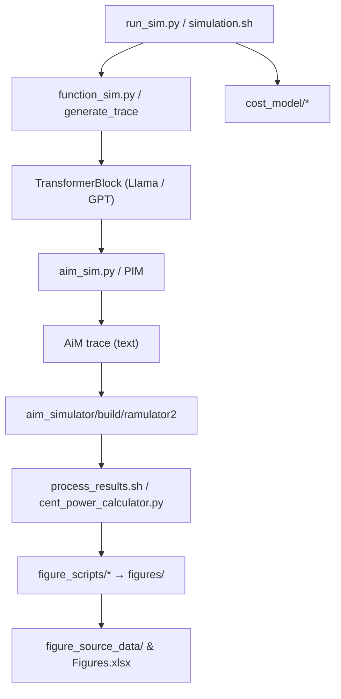

# cent_simulation — quick reference

This file summarizes the Python harness inside `cent_simulation/`: how modules map to dataflows, the key functions and call graph, a sample AiM trace excerpt, the custom AiM instructions used, and how parallelism flags are implemented in the artifact.

**Sections**
- Diagram: modules → dataflows
- Call graph & key functions (brief descriptions)
- Sample AiM trace excerpt + instruction set used
- Parallelism flags (what they mean and how implemented)

---

**Diagram (modules → dataflows)**



---

**Call graph & key functions (what they do)**

- `run_sim.py` (entry for full experiments)
  - `get_args()` — parse CLI used to orchestrate full experiment runs.
  - `generate_trace(args, seqlen_list)` — builds command lists that invoke `function_sim.py` with modes (pipeline vs model-parallel, embedding vs FC-only) and dispatches them in parallel.
  - `simulate_trace(...)` — runs the C++ AiM simulator (`ramulator2`) on generated trace files to get cycle-accurate DRAM/AiM timing.
  - `process_results(...)` / `update_csv(...)` — aggregate sim outputs and build CSVs used by plotting.

- `function_sim.py` (single-transformer-block harness)
  - main flow: build `dic_model` (small tensors or loaded checkpoint), choose `TransformerBlockLlama` or `TransformerBlockGPT` and call `memory_mapping()`.
  - modes:
    - `--only-trace` → `trace_only()` / `trace_only_embedding()` / `trace_only_FC()` on the TransformerBlock subclass — produce an AiM instruction trace (no heavy numeric compute).
    - `--pim-compute` → run aim-simulated compute paths (PIM-backed numeric emulation).

- `TransformerBlock` (in `TransformerBlock.py`) — the mapping & runtime layer
  - `__init__` — loads model tensors from `dic_model`, sets mapping parameters (heads, head_dim, channels, FC devices, flags).
  - `memory_mapping()` — compute rows/banks required and prints mapping info; central to how tensors get placed into DRAM bank/channel coordinates.
  - `store_to_DRAM_multi_channel(shape, row_index, mode, op_trace)` — top-level writer that maps different modes (weights, vector, cache_k, cache_v, score, bank groups) to physical banks/rows and issues single-bank stores (`store_to_DRAM_single_bank`) or AiM trace ops.
  - `load_from_DRAM_multi_channel(...)` — complementary loader that reconstructs vectors/matrices from bank layout used by `store_to_DRAM_multi_channel`.
  - `Vector_Vector_Mul`, `Vector_Matrix_Mul` and `Vector_Matrix_Mul_multithreads` — helpers that simulate GEMV/GEMM by splitting across DRAM columns / threads when needed (used as fallbacks for correctness validation and CPU reference).

- `TransformerBlockLlama` (in `Llama.py`) — LLaMA-specific mapping
  - `self_attention()` — PyTorch reference implementation used for verification.
  - `self_attention_aim()` — full mapping of attention to AiM primitives: RMSNorm via MAC/EWADD/EWMUL patterns, K/Q/V GEMV (weight GEMV on PIM), rotary embedding steps, key/value cache handling (store/load to banks), score GEMV, softmax via EWMUL/EWADD reductions, output GEMV, and write-back.
  - `FFN_aim()` — map FFN ops to PIM weight GEMVs and element-wise activation (SiLU) via EWMUL/COPY/AF patterns.

- `TransformerBlockGPT` (in `GPT.py`) — GPT-style trace-only flows
  - `trace_only()`, `trace_only_embedding()`, `trace_only_FC()` — produce detailed operation traces for the different stages (embedding, self-attention, FFN) without performing full numeric compute. These call many `*_only_trace` helpers in `aim_sim.py`.

- `PIM` and DRAM model (`aim_sim.py`)
  - Classes: `Bank`, `Channel`, `DIMM`, `PIM` model the memory hierarchy and an AiM device.
  - Low-level methods that emit op traces and/or emulate results: `store_to_DRAM_single_bank`, `load_from_DRAM_single_bank`, `MAC_BK_BK`, `MAC_BK_GB`, `EWMUL`, `EWADD`, `AF`, `RD_MAC`, `RD_AF`, `COPY_BK_GB`, `COPY_GB_BK`, `WR_GB`, etc.
  - Timing accounting (`self.time`) and trace file writing (`self.file`) are centralized here.

---

**Sample AiM trace (excerpt)**

The harness produced `cent_simulation/sample_aim.trace` for a single-token run (LLaMA-like configuration). The first lines show conventional memory stores to banks (`W MEM`) used when preparing data for AiM instructions.

Excerpt (first 40 non-comment lines):

```
W MEM 0 0 0
W MEM 0 2 0
W MEM 0 4 0
... (many `W MEM` writes that initialize GB / banks)
AiM WR_BIAS 0 0xffffffff
AiM MAC_ABK 4 0xffffffff 0
AiM RD_MAC 0 0xffffffff
AiM WR_ABK 0 0xffffffff 1024
...
```

Summary of opcode counts for this run:
- `W` (conventional bank writes/reads): 6784
- `AiM` (AiM-ISR lines): 1662
- `R` (conventional reads): 1344

AiM instruction breakdown (types and counts, single-token run):
- `WR_BIAS`: 434
- `MAC_ABK`: 434
- `RD_MAC`: 434
- `WR_ABK`: 256
- `WR_GB`: 40
- `AF`: 22
- `COPY_BKGB`: 12
- `COPY_GBBK`: 12
- `EWMUL`: 10
- `SYNC`: 5
- `EWADD`: 2
- `EOC`: 1

These counts reflect the trace-only flow with many store/read bookkeeping ops and the AiM-parallel reduction patterns used to compute RMSNorm, K/Q/V GEMV, softmax, and FFN activation.

---

**Custom AiM instructions (what they mean and how the harness uses them)**

The AiM trace uses the following ISR-like lines (the C++ AiM simulator implements these; see `aim_simulator/README.md`):

- `WR_SBK GPR_0 channel_mask bank row` — write 256b from GPR to single bank (used to write vector chunks into a bank row).
- `WR_ABK GPR_0 channel_mask row` — write 256b from GPR to 16 banks (used for broadcast writes across bank groups).
- `WR_GB opsize channel_mask` — write 256b from GPR to Global Buffer (GB) used for MAC/GEMV inputs.
- `WR_BIAS GPR_0 channel_mask` — write 256b to per-bank MAC accumulation registers (initialize bias/accumulators before MAC).
- `RD_MAC GPR_0 channel_mask` — read 256b from MAC accumulators to GPR (collect partial sums).
- `RD_AF GPR_0 channel_mask` — read element-wise activation registers (after `AF`) to GPR.
- `RD_SBK GPR_0 channel_mask bank row` — read 256b from a bank to GPR.
- `COPY_BKGB opsize channel_mask bank row` — copy from 16 banks → GB (gathers data to GB for GEMV/MAC).
- `COPY_GBBK opsize channel_mask bank row` — copy GB → 16 banks (scatter result from GB to banks).
- `MAC_ABK opsize channel_mask row` — parallel MAC across banks for vector dot/partial sums (used heavily for sum-of-squares and reductions).
- `MAC_SBK` / `MAC_BK_BK` / `MAC_BK_GB` — variants of MAC that use different bank/GB granularity; used to perform the inner-product/GEMV steps on PIM.
- `EWMUL opsize channel_mask row` — element-wise multiplication across 4-bank groups (used for broadcasting scalar→vector multiply and for softmax scaling patterns).
- `EWADD opsize` — element-wise add (used during reductions / softmax normalization).
- `AF channel_mask` — execute activation function in banks (SiLU/Sigmoid LUT approach implemented in `AF`).
- `SYNC` — barrier in AiM trace to order dependent operations.
- `EOC` — end-of-compute marker.
- `W MEM channel bank row` and `R MEM channel bank row` — conventional DRAM accesses (these appear when the harness writes/reads bank data directly).

How they are used in transformer mapping (short):
- RMSNorm: use `MAC_ABK` to compute sum-of-squares across banks, `RD_MAC` to collect partial sums, `EWADD`/`EWMUL` to broadcast scalar reciprocal sqrt and multiply, store norm vectors back to banks.
- K/Q/V GEMV: `WR_GB` + `MAC_BK_GB`/`MAC_BK_BK` patterns to perform matrix-vector multiplies on AiM.
- Rotary embedding: typically performed by element-wise `EWMUL` patterns reading/writing GB and bank groups.
- Softmax: compute exp via reduction patterns and normalize by broadcasting reciprocal sums (uses `EWMUL` + `EWADD` + `SYNC`).
- FFN/WGEMV: weight GEMVs mapped to `Vector_Matrix_Mul_weight_pim` helpers in `TransformerBlock` that generate sequences of `WR_GB`, `MAC_*`, and `RD_MAC`.

---

**Parallelism flags: meaning and how the artifact implements the hybrid of pipeline and tensor parallelism**

Flags (set via `utils.get_args()` / CLI):
- `--model-parallel` — enable model-parallel configuration (tensor-style parallelism across weight matrices / FC devices).
- `--model-parallel_embedding` (manifested as trace generation mode `model_parallel_embedding`) — generate embedding-stage traces where FC weights/embedding computations are sharded across FC devices.
- `--model-parallel_FC` (trace mode `model_parallel_FC`) — FC-only traces for measuring FC-sharded cost.
- `--pipeline-parallel` — generate pipeline-parallel traces, mapping transformer blocks across channels/devices (each device holds one or more transformer blocks in a pipeline stage).
- `--pipeline-parallel_embedding` — pipeline mapping for embedding stage traces.

How these map to the implementation (hybrid mapping):
- Resources and mapping variables used by the harness:
  - `num_channels` — channels per device (e.g., 32);
  - `num_devices` — available CXL devices;
  - `channels_per_block` — channels allocated to a single TransformerBlock (calculated as `num_channels // blocks_per_device` where `blocks_per_device` depends on model layer count and `num_devices`).
  - `FC_devices` — number of devices used to shard FC weights (tensor-parallel factor). The harness enumerates divisors of `num_devices` and uses these as candidate `FC_devices` values (see [run_sim.py](run_sim.py#L29)).

- Implementation details visible in code:
  - In `TransformerBlock.memory_mapping()` the code computes `total_banks = channels_per_block * num_banks` and then, if `model_parallel` is True, sets `FC_total_banks = total_banks * FC_devices`. That `FC_total_banks` is used when mapping weight matrices (wq,wk,wv,wo,w1,w2, etc.) across the expanded bank pool — implementing tensor-parallel sharding of weight rows across FC devices.
  - `run_sim.py` organizes trace generation into directories named by mode: `model_parallel`, `model_parallel_FC`, `model_parallel_embedding`, `pipeline_parallel`, `pipeline_parallel_embedding`. These are produced by calling `function_sim.py` with either `--model-parallel` or `--pipeline-parallel` and additional options such as `--FC-devices` or `--channels-per-block`.
  - The hybrid is expressed by two degrees of freedom the harness explores:
    1. Tensor-parallel (``tp`` in results): number of FC devices used to shard the large weight matrices (variable `FC_devices`). When `model_parallel` is enabled the harness sets `tp = FC_devices` and pipeline stages `pp = num_devices // FC_devices`.
    2. Pipeline-parallel (``pp`` in results): number of pipeline stages (how many sequential blocks are mapped across devices). For pipeline mode `pp` can be equal to the count of transformer blocks or derived from `num_devices` and `blocks_per_device` mapping.

- Practical consequence:
  - `--model-parallel` distributes weight storage and FC compute across `FC_devices` (tensor parallel), and pipeline stages are the quotient `num_devices // FC_devices`.
  - Without `--model-parallel` the harness uses `--pipeline-parallel` and assigns transformer blocks to channels/devices (pipeline stages) and uses `channels_per_block` to determine how many channels each block consumes; embedding mapping is treated specially via `pipeline_parallel_embedding`.
  - `--inter-device-attention` toggles whether attention key/value caches are kept per-device or distributed across devices (affecting `intra_device_attention` logic in `TransformerBlock`). This is important for long-context caching and determines whether cache reads/writes cross device boundaries.

Code references for the above behavior (quick links):
- Trace orchestration and mode choices: [cent_simulation/run_sim.py](run_sim.py)
- Transformer mapping and FC-device expansion: [cent_simulation/TransformerBlock.py](TransformerBlock.py#L1)
- LLaMA attention AiM mapping: [cent_simulation/Llama.py](Llama.py#L1)

---

If you want, I can:
- Render a visual PNG of the mermaid diagram and place it in `cent_simulation/`.
- Add a small `cent_simulation/run_single_trace.sh` wrapper that calls the exact CLI used here.
- Walk through the produced trace line-by-line for one attention micro-kernel and annotate which code emitted each AiM instruction.

---

Generated sample trace: `cent_simulation/sample_aim.trace` (created during this session).

End of file.
