# DDA Routing with a Breakable Wall — the `merg` topology mode

**Status**: design, pre-implementation · 2026-08-04 · fabric `n = 32`

Adds `merg`, a **topology mode** that restructures the fabric between a partitioned two-pool layout
and a single unified pool. Covers: what λ actually is, how `merg` is decided without inventing a new
tuned constant, and where it sits in the control loop.

Companion to [DDA_CONTROLLER_PLAN.md](DDA_CONTROLLER_PLAN.md) (tiers A–C) and
[DSE_REPORT.md](DSE_REPORT.md) (the split enumeration).

---

## 0. What `merg` is

**`merg` is not a flag read at the end of the pipeline. It selects which physical topology the
fabric is in, and everything downstream changes with it.**

| | `merg = 0` — partitioned | `merg = 1` — unified |
|---|---|---|
| pools | 2 — Pool L (`r·k` devices), Pool T (`n − r·k`) | 1 — all `n` devices |
| device role map | two disjoint role sets, two mappings | one mapping across the fabric |
| weight layout | Pool L: row `i` → bank `i mod 512r` · Pool T: block `b` → device `⌊b/bpd⌋` | one layout, `pp`/`tp` of the static config |
| routing | class-directed, L → Pool L, T → Pool T, overflow spills | class-blind, one queue |
| capacity gate | `Tput_L ≥ α·λ` **AND** `Tput_T ≥ (1−α)·λ` | `Tput ≥ λ` |
| λ_max | `min(Tput_L/α, Tput_T/(1−α))` | `Tput` — **α-invariant** |
| latency, L class | `TTFT_L`, degraded by spill | `TTFT_unified` |
| latency, T class | `req_lat_T` (packed) | `req_lat_unified` |
| KV `C_need` | `num_layers` (Pool T) / `k` (Pool L) | `pp` |
| controller surface | ladder, spill accounting, tiers A–C | none — nothing to resize |

Changing `merg` is therefore a **fabric-wide re-mapping**: every device changes role, all weights
re-shard, all in-flight KV drains. It is the highest-cost transition in the system — strictly more
expensive than any `(r, k, N_T)` move, which is why it gets its own tier and its own dwell rule
(§6).

Naming: `merg` deliberately avoids `m`, which already means TP-per-instance throughout
`dse_metrics.py` and `dda_controller.py` (`Rung.m`, `tier_b()`'s `r.m == self.split.m`, the `j × m`
factorization). No rename needed anywhere.

---

## 1. λ — what the symbol actually denotes

**λ is a token rate in tokens/s. It is offered load, not served load.** Not a request rate, and not
a sequence length.

The proof is in the units it is compared against. `feasible()` tests
`Tput_L >= alpha_tok * lam`, and `Tput_L` comes from `pool_throughput` =
`1000 / weighted_token_latency * pp` — tokens per second. So λ must be tokens per second too.

```
// offered demand, split by class
load_L = α · λ        tokens/s the latency class wants
load_T = (1−α) · λ    tokens/s the throughput class wants

// what comes back out of route()
served_total = served_by_L + served_by_T  ≤  λ
unmet        = load_L − served_by_L − spilled
```

That is why λ reappears as throughput at the end: **served throughput and offered load are the same
quantity in the same units**, and served is λ clipped by capacity. Below saturation
`served_total ≡ λ`, so the frontier's y-axis is flat in λ; above it, the gap `λ − served_total` is
the queued demand.

### Converting to requests per second

A request carries `S = prompt + generated` tokens, uniform over the simulated grid
`{128, 256, …, 4096}`, so `E[S] = 2112`:

```
λ_req = λ_tok / E[S]        E[S] = 2112 tokens
```

| model | λ ceiling (tok/s) | = req/s | = req/min |
|---|---:|---:|---:|
| Llama2-7B | 11 605 | 5.50 | 330 |
| Llama2-13B | 6 020 | 2.85 | 171 |
| Llama2-70B | 1 121 | 0.53 | 32 |

> ⚠️ **Do not confuse the two means.** `E[S] = 2112` is the *flat* mean and it is the correct one
> for the λ conversion — total token demand per second is arrival rate × mean tokens per request.
> The *survival-weighted* mean is `1450.7`, and that one is for weighting **latency** by how often
> each KV occupancy is visited. Different averages, different jobs. `alpha_token_share()` correctly
> uses `mean_seqlen`.

### Four properties worth stating explicitly

- **λ includes prompt tokens.** `seqlen = prompt + generated`, and prefill is modelled as a sum of
  decode steps, so prompt tokens consume the same rate budget.
- **λ is a fluid rate, not an arrival process.** No Poisson, no queue, no variance. The controller
  ticks at `dt = 30 s` and compares rate to rate.
- **α is a request fraction; feasibility uses the token fraction.**
  `α_tok = α_req·E[S_L] / (α_req·E[S_L] + (1−α_req)·E[S_T])`. Under the current symmetric mixture
  the two are identical — the conversion exists so an asymmetric histogram can be loaded later
  without breaking the model.
- **λ does not drive the KV gate.** `C_need` is set structurally (`= num_layers` for Pool T, `= k`
  for Pool L), never derived from λ.

> 🔴 **Gap — worth closing when you parameterize.** Little's Law gives an independent handle on
> concurrency: `C = λ_req · E[req_lat]`. The KV gate asserts `C_need = pp` from pipeline structure
> alone. Those are two routes to the same number and nothing currently checks they agree. Adding the
> cross-check turns the KV gate from an assumption into a validated constraint — pure
> post-processing on data already in hand.

---

## 2. Notation — your symbols against the code

| yours | code | meaning | range (n = 32) |
|---|---|---|---|
| `n` | `FABRIC` | devices in the fabric | 32 |
| `r` | `m`, `TP_per_instance` | devices per Pool L instance = TP degree | cap_floor … N_L |
| `k` | `j`, `n_instances` | Pool L instances (data-parallel replicas) | 1 … N_L / cap_floor |
| `r·k` | `N_L` | Pool L devices | 7B 1–26 · 13B 2–22 · 70B 9–16 |
| `n − r·k` | `N_T` | Pool T devices | 7B 6–31 · 13B 10–30 · 70B 16–23 |
| `λ` | `lam` | offered token rate | tokens/s |
| `α` | `alpha_tok` | latency-class share of token demand | 0 … 1 |
| **`merg`** | *— new —* | **topology mode.** 0 = two pools, 1 = one pool | {0, 1} |

Your `r` and `k` are the code's `m` and `j`. Renaming the code to match your paper notation is
optional and independent of this work — `merg` collides with nothing either way.

---

## 3. Reformulation — the config space becomes a union of two topologies

The current optimizer searches one family of configurations. The reformulation widens the search to
a **union of two topology families** and lets `merg` fall out of a single scoring function — rather
than adding a hand-set switch, which would introduce exactly the kind of unmeasured constant this
project has been systematically eliminating (cf. the `max_spill_frac` sweep).

```
// configuration space
𝒞(n) = 𝒞_split ∪ 𝒞_merged

𝒞_split (merg=0) = { (r, k, N_T) : r·k + N_T = n,  r ≥ cap_floor,  N_T ≥ N_T_min }
𝒞_merged(merg=1) = { (pp, tp) : CENT static at n devices,  pp divides L }
```

`𝒞_merged` is **already computed** — it is `dse_metrics.static_configs(model, 32)`, the same rows the
Pareto baseline uses. Nothing new needs simulating. What changes is that those rows stop being a
*baseline* and become *candidates*.

Full per-topology semantics are the table in §0.

### Four structural facts that make the decision tractable

1. **λ_max under `merg = 1` is independent of α.** A single pool does not care about the class mix.
   That is the whole robustness argument for merging: no α tracking, no split selection, no drain,
   ever.

2. **Aggregate throughput is roughly conserved across the wall.** Devices are conserved, so
   partitioning neither creates nor destroys capacity — it *reallocates latency*. Measured
   best-vs-best system throughput: 7B **11 605** split vs **11 505** merged (+0.9%); 70B **1 121**
   vs **1 252** (**−10%**). The exception is 13B at **6 020** vs **4 402** (+37%) — and that is
   finding 6 paying off, because the merged mapping strands 12 of 32 devices.

3. **`merg = 1` is unconditionally cheaper to operate.** One pool means no split search, no ladder,
   no reshard, no drain transient. The partitioned topology has to *earn* that cost.

4. **What partitioning buys is exactly one thing: a second latency class.** It earns its cost if and
   only if Pool L is actually large enough to serve the L class. When it is not, spill collapses the
   two classes back into one — at Pool T's latency, which is *worse than any merged config*, because
   Pool T on `N_T < n` devices is slower than a unified pool on `n`.

> 🟢 **The reframing this buys the paper.** Right now 70B is a counterexample to report and explain
> away. With `merg` in the algorithm it becomes a **validation case**: the optimizer is handed the
> choice not to partition, and for 70B it correctly declines. The claim upgrades from *"DDA wins on
> two of three models"* to *"the allocator partitions exactly where a uniform mapping wastes the
> fabric, and declines where it does not."* Same data; the negative result becomes evidence the
> method works.

---

## 4. The merge criterion — derived, not tuned

Score both topologies with the objective already in `annotate_candidates()`, extended so the
normalizers come from the union:

```
// spill-aware effective latency of the L class  (finding 15)
merg=0:  eff_lat_L = (served_L·TTFT_L + spilled·req_lat_T) / (served_L + spilled)
merg=1:  eff_lat_L = TTFT_unified          // spill is undefined — one pool

// normalizers over the UNION, one per class
lat_L* = min over 𝒞 of eff_lat_L(c)
lat_T* = min over 𝒞 of lat_T(c)

// one objective, both topologies
J(c) = α · eff_lat_L(c)/lat_L*  +  (1−α) · lat_T(c)/lat_T*

c*    = argmin { J(c) : c ∈ 𝒞, feasible(c), kv_ok(c) }
merg* = 1  if  c* ∈ 𝒞_merged  else  0
```

> 🔴 **Trap — this one is silent.** `annotate_candidates()` currently computes `bl` and `bt` from
> `base`, the DDA table alone. Left that way, merged and split J values are normalized against
> *different* denominators and are not comparable — the comparison would look like it works and
> would be meaningless. The normalizers must be taken over the union.

### A closed-form screening test, no simulation needed

Before scoring anything, one inequality decides whether partitioning is even possible. Pool L
throughput is bounded above by the best factorization available:

```
Tput_L^max(model, n) = max over 𝒞_split of  k · Tput_L(TP = r)

α_crit(λ) = Tput_L^max / λ

if α > α_crit  →  no partition can hold the L class  →  merg = 1 by capacity
```

This is a hyperbola `α·λ = Tput_L^max` in the (λ, α) plane. Below it, partitioning is on the table;
above it, every split spills and the unified topology dominates by construction. Measured
(unsaturated, KV-feasible):

| model | argmax config | Tput_L^max | as % of fabric | α_crit at λ ceiling |
|---|---|---:|---:|---:|
| Llama2-7B | 26×TP1 / N_T6 | 8 720 | 75% | 0.751 |
| Llama2-13B | 11×TP2 / N_T10 | 2 966 | 49% | 0.493 |
| Llama2-70B | 1×TP16 / N_T16 | **117** | **10.5%** | **0.105** |

70B's entire Pool L is **10.5% of fabric throughput**. At full load it can only serve a latency
class up to α = 0.105 — above that, no partition exists that works, and the answer is forced without
running anything. This is finding 10b (`j ≡ 1` structurally) turned into a decision rule.

### Two mechanisms, one rule

- **Capacity-driven merge** — Pool L is too small at any partition. Caught by the screening test.
  This is 70B.
- **Efficiency-driven merge** — partitioning is feasible but a unified pool is simply better,
  because a device count that divides the layer count exactly strands nothing and partitioning only
  makes both pools smaller. No closed form; it emerges from the J comparison. This is 7B above
  λ/cap ≈ 0.6 (finding 13).

The screening test is *sufficient* to merge. The J comparison is the *complete* rule. Run the cheap
one first.

---

## 5. Evidence — why 70B merges, measured

At α = 0.30, λ = 504.5 tok/s (45% of the split ceiling), from `frontier_static.csv` and
`frontier_dda.csv`:

| topology | config | eff. latency (s) | total tput | spill | feasible |
|---|---|---:|---:|---:|---|
| merged | PP8 / TP4 | **2.70** | 719 | — | yes |
| merged | PP16 / TP2 | 3.84 | 1 077 | — | yes |
| merged | PP80 / TP1 | 17.82 | **1 252** | — | yes |
| split | 1×TP9 / N_T23 | **45.89** | 1 118 | 29.0% | yes |
| split | 1×TP12 / N_T20 | **46.85** | 1 121 | 27.1% | yes |
| split | 1×TP16 / N_T16 | **51.75** | 874 | 22.5% | yes |

**Strict domination.** The best partition is 17× worse on effective latency (45.9 s vs 2.70 s)
*and* 10% worse on peak throughput (1 121 vs 1 252). There is no matched-TTFT row for 70B in
`frontier_matched.csv` at all — the file is empty for it, because the two topologies do not overlap
on the latency axis.

**The mechanism is visible in one column.** Pool L delivers 110 tok/s against `α·λ = 151` tok/s of
demand, so 27% of the latency class spills into Pool T — whose request latency is **167 s**, because
it is an 80-layer pipeline packed onto 20 devices at 4 blocks each. That 27% at 167 s drags the
mixture from 2.06 s to 46.9 s. The partition pays its full cost and delivers essentially no
isolation.

**Why the unified topology cannot fail this way**: spill is undefined under `merg = 1`. One pool
means one latency, so there is no path by which the L class inherits a slower pool's completion
time. Merging trades away the *possibility* of isolation for the *guarantee* that isolation never
inverts.

---

## 6. `merg` in the control loop — Tier D

A `merg` transition re-maps every device in the fabric, so all `n` drain. It sits above the existing
ladder:

| tier | move | devices draining | trigger |
|---|---|---|---|
| A | spill excess L into Pool T | 0 | immediate, free |
| B | grow k at fixed r | Pool L only | `T_grow = 2·T_drain` |
| C | change r or N_T | both pools | `T_grow` / `T_shrink` |
| **D** | **change `merg` — build or break the wall** | **all n** | **longest dwell; see below** |

- **Decide `merg` at provision, not per tick.** Look it up from the offline `merg*(model, λ, α)` map
  built in Phase 0. The runtime only re-topologises on sustained regime change, never on α drift.
- **Give it its own dwell threshold, and make it the longest.** `switch_economics()` already
  computes this — feed it `draining = n`. For 70B, median `T_drain = 348 s` across the whole fabric
  puts breakeven in the hours, so D never fires and 70B is provisioned once and left. Consistent
  with finding 10d.
- **`merg = 1` makes the controller a no-op.** No pools to size, no spill accounting, no ladder.
  Worth saying plainly in the paper: the unified topology is also the lowest-risk deployment, and
  the algorithm reaches for it exactly when partitioning cannot pay.

> **Deliberately out of scope — a third topology.** `merg` could be ternary: hard wall (physical
> partition) · **soft wall** (one pool, priority scheduling so L-class requests preempt at request
> boundaries) · no wall. The soft wall is the theoretically best option — isolation without capacity
> fragmentation — but it needs a queueing model CENT does not have (batch-1, sequential kernel, no
> queue anywhere in the simulator). Keep `merg` boolean; list the soft wall as future work.

---

## 7. Decision flow

```mermaid
flowchart TD

  subgraph P0["PHASE 0 — OFFLINE, ONCE PER MODEL"]
    direction TB
    A1["config.json<br/>L · d · n_heads · n_kv_heads · ffn · vocab"]
    A2["derive: W_total · KV/token<br/>cap_floor · TP_sat · min_cpb"]
    A3["enumerate C_split<br/>r·k + N_T = n"]
    A4["enumerate C_merged<br/>CENT static at n, pp divides L"]
    A5["latency curves for both topologies<br/>simulate, or analytic AiM cost model"]
    A6["UNIFIED TABLE<br/>one row per config, column merg = 0 | 1"]
    A7["Tput_L_max = max of k·Tput_L(r)<br/>gives alpha_crit(lambda) hyperbola"]
    A8["ladder: tier endpoints + Pareto k<br/>+ merged rungs"]
    A1 --> A2
    A2 --> A3
    A2 --> A4
    A3 --> A5
    A4 --> A5
    A5 --> A6
    A6 --> A7
    A6 --> A8
  end

  P0 --> B0
  B0["PHASE 1 — OBSERVE<br/>measure lambda, alpha_req this tick<br/>alpha_tok = token-share convert<br/>alpha_s = EWMA smooth"]
  B0 --> C1

  C1{"PHASE 2 — SCREEN<br/>alpha_tok · lambda &gt; Tput_L_max ?"}
  C1 -->|"yes — no partition can hold L"| M1
  C1 -->|"no"| D1

  D1["PHASE 3 — SCORE<br/>both topologies, one objective"]
  D1 --> D2
  D2["gate every config<br/>capacity: Tput_L &gt;= a·lam AND Tput_T &gt;= (1-a)·lam<br/>KV: kv_slack &gt;= margin on both pools"]
  D2 --> D3
  D3["route each surviving config<br/>merg=0: spill excess L into T, get eff_lat_L<br/>merg=1: eff_lat_L = TTFT_unified"]
  D3 --> D4
  D4["normalize over the UNION<br/>lat_L* = min eff_lat_L · lat_T* = min lat_T"]
  D4 --> D5
  D5["J = a·eff_lat_L/lat_L* + (1-a)·lat_T/lat_T*<br/>c* = argmin J"]
  D5 --> E1

  E1{"c* in C_merged ?"}
  E1 -->|"yes"| M1
  E1 -->|"no"| L1

  M1["merg* = 1 — UNIFIED TOPOLOGY<br/>one pool of n devices, one mapping<br/>class-blind FIFO, no spill path<br/>lambda_max is alpha-invariant"]
  L1["merg* = 0 — PARTITIONED TOPOLOGY<br/>Pool L = r x k · Pool T = n - r·k<br/>two mappings, class-directed + spill"]

  M1 --> F1
  L1 --> F1

  F1{"PHASE 4 — ACT<br/>c* differs from deployed config ?"}
  F1 -->|"no"| H1["HOLD<br/>route this tick, accrue ledgers"]
  F1 -->|"yes"| F2

  F2{"classify the move"}
  F2 -->|"L overflow absorbed by spare T"| TA["TIER A — spill<br/>0 draining, instant"]
  F2 -->|"same r, more k"| TB["TIER B — grow k<br/>Pool L reshards only"]
  F2 -->|"r or N_T changes, merg same"| TC["TIER C — resplit<br/>both pools drain"]
  F2 -->|"merg changes"| TD["TIER D — RE-TOPOLOGY<br/>build or break the wall<br/>ALL n devices re-map and drain"]

  TA --> H1
  TB --> G1
  TC --> G1
  TD --> G2

  G1{"dwell &gt;= T_grow / T_shrink ?"}
  G2{"dwell &gt;= T_flip ?<br/>switch_economics with draining = n"}
  G1 -->|"no"| H1
  G1 -->|"yes"| K1
  G2 -->|"no — regime not proven"| H1
  G2 -->|"yes"| K1

  K1["COMMIT<br/>set derate = draining/n for T_drain seconds<br/>shadow = old config, reset both ledgers"]
  K1 --> H1
  H1 --> B0

  classDef merged fill:#5B4EA0,stroke:#3E3576,color:#FFFFFF
  classDef split  fill:#B0651A,stroke:#7E4711,color:#FFFFFF
  classDef poolt  fill:#1C6B75,stroke:#124A52,color:#FFFFFF
  classDef warn   fill:#A33B2E,stroke:#75281E,color:#FFFFFF

  class M1 merged
  class L1 split
  class D2,D3 poolt
  class TD warn
```



---

## 8. Implementation deltas — what changes, in order

Nothing here needs a new simulation. All 118 pool sims, all 120 static sims and
`dse_full_table.csv` stand as-is; this is post-processing and policy.

| # | file | change | why |
|---|---|---|---|
| 1 | `explorer/dse_metrics.py` — `static_configs()` | add KV feasibility columns — cpb from the config, `C_need = pp` | 🔴 Merged configs would otherwise enter the comparison ungated while partitions are gated. That asymmetry is a correctness bug, not a cosmetic one. |
| 2 | `explorer/dse_metrics.py` — `annotate_candidates()` | take `bl` / `bt` from the union of both topologies | 🔴 Otherwise J is normalized against different denominators per topology and the comparison is meaningless. |
| 3 | *new* merged-row builder | emit static configs into the `dse_full_table` schema with `merg = 1`, `N_L = 0`, `N_T = n` | One table, one schema, one optimizer. Avoids a parallel code path that can drift. |
| 4 | `explorer/dse_metrics.py` | `tput_L_max(model, n)` and `alpha_crit(lam)` | The screening test — cheap, closed-form, runs before any scoring. |
| 5 | `explorer/dda_controller.py` — `route()` | branch on `merg`: unified has no spill, `served = min(λ, Tput)`, `eff_lat = TTFT_unified` | Spill is undefined for one pool. Reusing the partitioned path would fabricate a spill term. |
| 6 | `explorer/dda_controller.py` — `ladder()`, `Controller` | merged rungs in the ladder; Tier D with its own dwell via `switch_economics(draining = n)` | Makes `merg` reachable at runtime without letting it thrash. |
| 7 | `simulation/tput_latency_frontier.py` | score both topologies with the shared J instead of plotting them as separate series | It already loads both. It just does not compare them on one objective yet. |
| 8 | `app/app.py` | surface `merg*` and `α_crit` on the frontier tab | This is the visual check to run before parameterizing. |

---

## 9. Open decisions

1. **Is `merg` allowed to change at runtime at all?** Recommendation: build the offline
   `merg*(model, λ, α)` map, allow Tier D transitions only on sustained regime change, and expect
   zero for 70B. Freezing `merg` at provision is simpler and costs almost nothing.
2. **Does 𝒞_merged include MP configs, or PP only?** All six 70B static configs are legal; but MP at
   `tp > 1` pays CXL every layer for a class mix that does not need it. Including them is more honest
   and costs nothing.
3. **Rename the code's `m` → `r`, `j` → `k` to match paper notation?** Independent of this work —
   `merg` collides with nothing either way. Touches two modules, four scripts and a CSV column.
4. **Add the Little's Law cross-check on `C_need`?** Pure post-processing; turns the KV gate from a
   structural assumption into a validated one.
